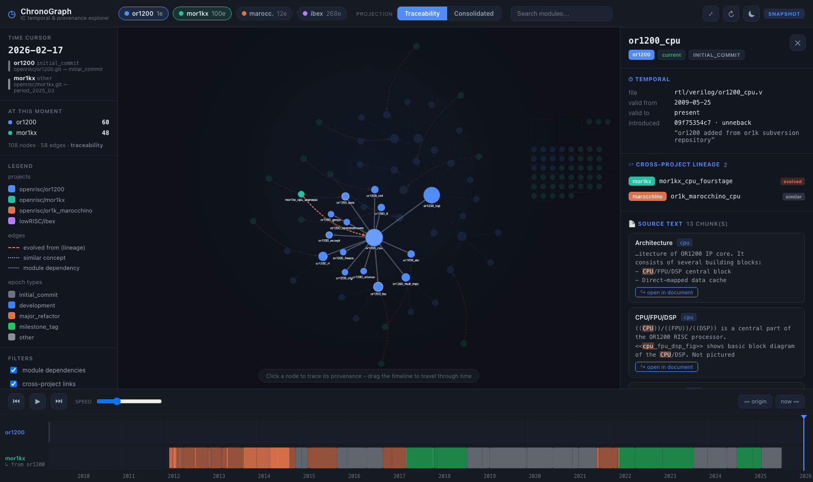

# ChronoGraph — IC Temporal & Provenance Visualizer

A bespoke visualizer for the IC knowledge graph, built to show off what the
stock ArangoDB Graph Visualizer cannot: **time-travel across epochs**,
**provenance down to the exact span of source text / Verilog**, **cross-project
lineage**, and a **traceability ↔ consolidated** projection toggle.



## Why this exists

The ArangoDB visualizer renders a static graph. This project's value is in its
*temporal* and *provenance* structure — bitemporal validity on every node,
`DesignEpoch` boundaries, `DOCUMENTED_BY` links from Verilog to spec text,
consolidated golden entities, and `CROSS_REPO_EVOLVED_FROM` lineage across the
OpenRISC family. ChronoGraph is built around exactly those axes.

## The four pillars

| Pillar | How to use it |
|---|---|
| **Time-travel & epochs** | Drag the playhead on the timeline, hit ▶ to animate, or ⏮/⏭ to step epoch boundaries. The graph re-slices to show only what was valid at that instant (`valid_from_ts ≤ T < valid_to_ts`). |
| **Provenance to exact source** | Click any node → the inspector lists the doc chunks and Verilog it came from. "↪ open in document" / "↪ open source" opens the full text with the supporting span highlighted and scrolled into view. |
| **Traceability ↔ Consolidated** | Toggle the projection. *Traceability* shows the raw web (modules, dependencies). *Consolidated* collapses sources into one golden entity that links directly to its chunks + Verilog, and whose relations carry consolidated evidence ("verilog + N doc"). |
| **Cross-project** | Enable multiple project chips. Dashed orange = `evolved from` (lineage), dotted = `similar concept`. The timeline shows one swimlane per project with lineage annotations, so you can see how an epoch in one project relates to another. |

## Quick start

```bash
cd viz
python -m venv .venv && source .venv/bin/activate
pip install -r requirements.txt

# build the offline snapshot from the repo's data/ exports (one time)
python -m ic_viz.build_snapshot

# run
python server.py            # → http://127.0.0.1:8700
```

## Data source: offline snapshot ↔ live DB

ChronoGraph runs against either source through one identical query contract:

- **`SnapshotSource`** (default) reads `viz/snapshot/snapshot.json`, built from the
  repo's `data/` exports. Works with no database. Cross-repo lineage and the
  consolidated golden layer are *derived* here (and tagged `derived: true`) —
  the live DB computes them with embeddings.
- **`ArangoSource`** reads the live temporal graph over AQL.

Selection is automatic: if the `.env` credentials connect, ChronoGraph uses the
live DB; otherwise it falls back to the snapshot. Force it with:

```bash
CHRONO_SOURCE=arango   python server.py   # require live DB
CHRONO_SOURCE=snapshot python server.py   # force offline
```

The active source is shown as a badge (top-right): `SNAPSHOT` or `LIVE`.

> The bundled snapshot spans **2009–2026**: 4 projects, 381 epochs, 3,796 commits,
> 6,220 module-versions, real spec-text provenance for or1200, and derived
> cross-project lineage (or1200 → mor1kx → marocchino).

## Architecture

```
viz/
  server.py               uvicorn entrypoint
  ic_viz/
    api.py                FastAPI routes + static SPA mount
    datasource.py         DataSource contract: SnapshotSource + ArangoSource
    build_snapshot.py     data/ exports → snapshot.json (+ derived layers)
  web/
    index.html
    css/style.css         theme-aware (dark/light) IDE styling
    js/api.js             fetch wrapper
    js/graph.js           Cytoscape: styling + position-preserving reconciliation
    js/timeline.js        SVG epoch swimlanes, draggable playhead, epoch stepping
    js/inspector.js       provenance panel + source viewer (highlight + scroll)
    js/app.js             state, play loop, controls, wiring
    vendor/               cytoscape.js + fcose (vendored for offline use)
  snapshot/snapshot.json  built artifact (gitignored)
```

### API contract

| Endpoint | Returns |
|---|---|
| `GET /api/repos` | project cards + timeline bounds |
| `GET /api/timeline` | epochs (as bands) + lineage ribbons |
| `GET /api/slice?ts=&repos=&projection=` | Cytoscape elements valid at `ts` |
| `GET /api/provenance?id=` | text + Verilog + structure + relations + lineage |
| `GET /api/source?kind=&ref=&terms=` | full chunk/Verilog text + highlight spans |
| `GET /api/search?q=&repos=` | module lookup |

## Live DB (`ArangoSource`) — fully wired

All endpoints run against the live temporal DB (verified 2026-07):

- **slice/traceability** — bitemporal filter on temporal `RTL_Module` versions;
  `DEPENDS_ON` joined across the deep-structural namespace (`SNAPSHOT_OF`-style
  `PREFIX_label` key join); cross-repo links derived per-slice by functional concept.
- **slice/consolidated** — real `{PREFIX}_Golden_Entities` +
  `{PREFIX}_Golden_Relations` (with `source_chunks` evidence counts) + real
  `CROSS_REPO_EVOLVED_FROM` / `CROSS_REPO_SIMILAR_TO` (embedding similarity).
  The golden layer is atemporal by design — the time cursor drives the
  traceability projection and epoch context.
- **provenance (golden entity)** — chunks via `Consolidates → MentionedIn →
  Chunks` with highlighted alias spans; RTL evidence via inbound `RESOLVED_TO`
  (match method + score); Verilog from the most-resolved parent module's
  `code_content`; relations with `context` + source-chunk evidence; real
  cross-repo lineage with confidence scores.
- **provenance (module version)** — temporal facts + introducing commit; deep
  structure (ports/signals); concept text provenance via
  `port → RESOLVED_TO → golden → chunk`.

### Known live-cluster quirk (ERR 4)

String predicates (`CONTAINS`, `LIKE`) on `RTL_Module` trigger the AMP cluster
planner bug — `[ERR 4] member out of range` (same bug documented in
`src/cross_repo_bridge.py`). Workaround used here: `search()` COLLECTs the
module label index once (equality filters only) and substring-matches in
Python. Equality filters and numeric range filters are unaffected.
